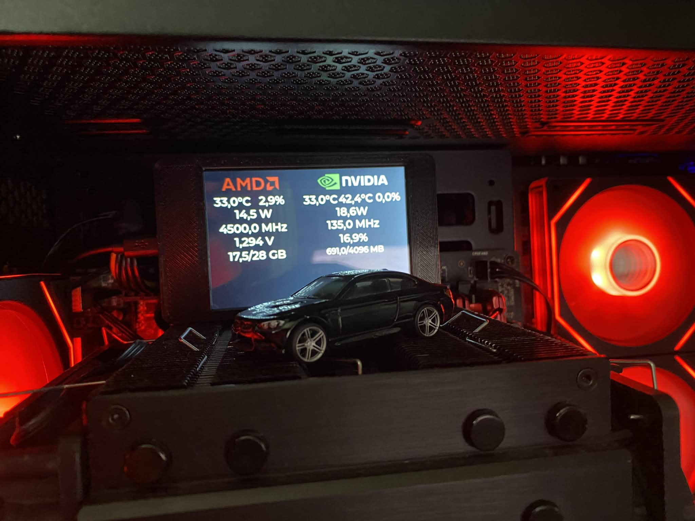

# Live PC Stats Monitor with ESP32 & SquareLine Studio

## 🚀 Project Overview

This project is a dedicated, real-time hardware monitor display powered by an **ESP32** microcontroller. It visualizes critical PC statistics (CPU, GPU, RAM) on an external screen with a modern GUI designed in **SquareLine Studio**.

Unlike the initial version, this system now supports high-speed data transmission via **USB Serial**, with optional support for **Wi-Fi**. The PC-side logic parses sensor data and transmits it to the ESP32, where it is rendered using the LVGL library.

## ✨ Features

* **Modern GUI:** Professional-grade interface designed using **SquareLine Studio** (LVGL).
* **Dual Connectivity:**
    * **USB Serial:** Low latency, reliable wired connection (Primary).
    * **Wi-Fi:** Wireless capabilities for remote monitoring.
* **Multi-Language PC Clients:**
    * **Python Script:** Lightweight script for parsing and sending data via Serial.
    * **Java Application:** Robust, full-featured application (Main implementation) supporting both Serial and Wi-Fi.
* **Real-time Parsing:** Efficient extraction of hardware parameters on the host machine.

## 🔧 Technology Stack

### PC Side (Data Sender)
* **Java Application (Main):** Handles data collection and transmission (supports Serial & Wi-Fi).
* **Python Script:** Alternative script for parsing logs/sensor data and sending via Serial.
* **LibreHardwareMonitor / System APIs:** Sources for granular CPU, GPU, and Memory data.

### Display Side (ESP32 Client)
* **ESP32 Microcontroller:** Handles data reception (Serial/UDP/HTTP) and rendering.
* **SquareLine Studio:** Used for UI layout and design.
* **LVGL (Light and Versatile Graphics Library):** The underlying graphics engine.
* **TFT_eSPI:** Hardware driver for the display.

## 📊 Current Metrics

The system currently parses and displays:
* **CPU:** Temperature, Load, Clock Speed
* **GPU:** Core Temperature, Memory Usage
* **RAM:** Used/Free memory
*(List expands based on the parser configuration)*

## 💻 Setup and Usage

### 1. ESP32 Setup
1.  Open the project in **PlatformIO** or **Arduino IDE**.
2.  Ensure the `TFT_eSPI` and `lvgl` libraries are correctly configured for your specific display driver.
3.  Flash the firmware to your ESP32.
4.  The screen will initialize the SquareLine UI and await data packets.

### 2. PC Side Setup
You can choose between the Java application or the Python script.

#### Option A: Java Application (Recommended)
* Build and run the Java project.
* Select your COM port (for Serial) or IP address (for Wi-Fi).
* The app will start sending parsed frames to the ESP32.

#### Option B: Python Script
* Install required dependencies (e.g., `pyserial`, `psutil`).
* Run the script: `python monitor.py`
* The script detects the ESP32 COM port and begins streaming data.
